<div align="center">

# 📞 4G Voice Notification Gateway

**ระบบเกตเวย์โทรแจ้งเตือนด้วยข้อความเสียงอัตโนมัติผ่านเครือข่าย 4G**

<sub>Design and Development of an Automated Voice Notification Gateway Server over 4G Network</sub>

<br/>


<br/>

*เมื่อระบบมีปัญหา — ไม่ต้องรอให้ใครเห็นอีเมล ให้โทรศัพท์ดังเลย*

</div>

---

## 💡 ระบบนี้คืออะไร

**Robo-calling Gateway ขนาดเล็ก** ที่ติดตั้งใช้เองภายในองค์กร (Self-hosted / On-Premise) บน Raspberry Pi
ทำหน้าที่ **โทรศัพท์ไปหาเจ้าหน้าที่โดยอัตโนมัติพร้อมพูดข้อความภาษาไทย** เมื่อเกิดเหตุฉุกเฉิน
เช่น เซิร์ฟเวอร์ล่ม ตู้ควบคุมขัดข้อง หรือค่าเซ็นเซอร์ผิดปกติ

โทรออกผ่าน **ซิมโทรศัพท์จริง** ด้วยคำสั่ง AT ที่ส่งตรงเข้าโมดูล 4G — ไม่พึ่งบริการ Cloud Call Center
ที่ต้องจ่ายรายเดือน และไม่พึ่ง VoIP

> **ที่มาของโจทย์:** เดิมองค์กรใช้บริการแจ้งเตือนจากภายนอกแบบจ่ายรายเดือน ค่าใช้จ่ายสะสมไปเรื่อยๆ
> โครงงานนี้จึงออกแบบและพัฒนาระบบขึ้นมาเองเพื่อ **ลดค่าใช้จ่ายระยะยาว** และ **ควบคุมระบบได้เต็มที่**
> — พัฒนาระหว่างการปฏิบัติงานสหกิจศึกษา สาขาวิศวกรรมคอมพิวเตอร์

---

## ⚡ ทำงานยังไง

```mermaid
flowchart LR
    IoT["🔌 อุปกรณ์ IoT<br/>เซ็นเซอร์ / ระบบ monitor"]
    API["⚙️ FastAPI<br/>ตรวจ API key"]
    Queue["📋 คิวงาน<br/>SQLite"]
    TTS["🗣️ gTTS<br/>ข้อความ → เสียงไทย"]
    GSM["📡 โมดูล 4G<br/>SIMCOM A7670E"]
    Phone["📞 เจ้าหน้าที่"]

    IoT -->|"POST /notify"| API --> Queue --> TTS --> GSM -->|"โทรออกผ่านซิมจริง"| Phone

    style IoT fill:#dbeafe,stroke:#3b82f6,color:#1e3a5f
    style API fill:#fef3c7,stroke:#f59e0b,color:#78350f
    style Queue fill:#fef3c7,stroke:#f59e0b,color:#78350f
    style TTS fill:#fce7f3,stroke:#ec4899,color:#831843
    style GSM fill:#f0fdf4,stroke:#22c55e,color:#166534
    style Phone fill:#f0fdf4,stroke:#22c55e,color:#166534
```



**หัวใจของการออกแบบคือ อุปกรณ์ปลายทางไม่ต้องรู้อะไรเลยว่าจะโทรหาใคร**

บอร์ด/เซ็นเซอร์แค่ส่งมาว่า *"เกิดเหตุประเภทนี้"* พร้อม API key ประจำตัว จากนั้นเป็นหน้าที่ของเกตเวย์
ที่จะตัดสินใจเองว่าต้องโทรหากลุ่มไหน เรียงลำดับใคร และพูดข้อความว่าอะไร — ทั้งหมดแก้ได้จากหน้าเว็บ
โดย**ไม่ต้องแฟลช firmware ของบอร์ดใหม่เลย** ย้ายจุดติดตั้งหรือเปลี่ยนเบอร์คนรับสายก็แก้ที่เดียวจบ

### ลำดับการโทร (Escalation)

| ขั้น | เกิดอะไรขึ้น |
|:---:|---|
| 1️⃣ | โทรหาเบอร์แรกในกลุ่ม |
| 2️⃣ | ปลายสายรับ → **เว้น 2 วินาทีให้ยกหูขึ้นแนบหูก่อน** แล้วค่อยเล่นข้อความ |
| 3️⃣ | **พูดข้อความซ้ำ 2 รอบ** เว้นรอบละ 1.5 วินาที (หยุดเองถ้าปลายสายวางก่อน) |
| 4️⃣ | ไม่รับสาย / สายไม่ว่าง → โทรซ้ำตามจำนวนรอบที่ตั้งไว้ |
| 5️⃣ | ยังไม่รับอีก → ไล่ไปเบอร์ถัดไปในกลุ่ม |
| 6️⃣ | ครบทุกเบอร์แล้วไม่มีใครรับ → บันทึกเป็น `failed` พร้อมเหตุผลให้ตรวจสอบย้อนหลังได้ |

ค่าทั้งหมดปรับได้จากหน้า **ระบบ & ฮาร์ดแวร์** ไม่ต้องแก้ไฟล์หรือ SSH เข้าเครื่อง:
จำนวนครั้งที่โทรซ้ำ · เวลารอก่อนโทรซ้ำ · เวลารอให้รับสาย · เว้นช่วงก่อนเริ่มพูด · จำนวนรอบที่พูดซ้ำ

> **กันสายโทรกลับ:** ผู้รับที่ไม่รู้ว่าเป็นระบบอัตโนมัติมักกดโทรกลับ ระบบตรวจเจอสายเรียกเข้า
> แล้ววางให้อัตโนมัติภายใน 1-2 วินาที — ถ้าปล่อยไว้ สายที่ค้างจะทำให้งานถัดไปในคิวโทรออกไม่ได้
> แล้วระบบจะสรุปผิดว่า "ไม่มีใครรับ" ทั้งที่ปลายทางไม่เคยดังเลย

---

## 🖥️ หน้าตาระบบ

<div align="center">

| ภาพรวมระบบ | จัดการอุปกรณ์ |
|---|---|
|  |  |

| ประวัติการโทร | โหมดมืด |
|---|---|
|  |  |

</div>

Dashboard ออกแบบด้วย Figma แล้วพอร์ตเป็นโค้ดจริงทั้ง 10 หน้า รองรับทั้งภาษาไทย/อังกฤษ
โหมดสว่าง/มืด และปรับตามขนาดจอตั้งแต่มือถือจนถึงจอกว้าง

---

## 🧩 เทคโนโลยีที่ใช้

<table>
<tr><td><b>Backend</b></td><td>FastAPI · SQLAlchemy · Alembic · SQLite (WAL mode)</td></tr>
<tr><td><b>Frontend</b></td><td>Vite · React 18 · TypeScript · Tailwind CSS v4 · shadcn/ui</td></tr>
<tr><td><b>เสียงพูด</b></td><td>Google Text-to-Speech (gTTS) — ภาษาไทย</td></tr>
<tr><td><b>ฮาร์ดแวร์</b></td><td>Raspberry Pi 3 · SIMCOM A7670E / A7670C (4G LTE Cat.1) · ซิม AIS<br>ต่อได้ทั้งผ่าน USB และผ่านหัว GPIO (UART + คุมขา PWRKEY/RESET/STATUS)</td></tr>
<tr><td><b>Deploy</b></td><td>Docker (multi-stage build) · GitHub Actions self-hosted runner บน Pi</td></tr>
<tr><td><b>ความปลอดภัย</b></td><td>API key รายอุปกรณ์ (เก็บแค่ sha256 hash) · JWT + bcrypt · gitleaks pre-commit</td></tr>
</table>

### สถาปัตยกรรม 3 ชั้น

```
🌐 API Layer      รับคำสั่ง ตรวจสิทธิ์ จัดการข้อมูลทั้งหมด
      ↓
📋 Queue Layer    คิว FIFO บน SQLite + กันงานซ้อนกันแบบ atomic
      ↓
📞 Worker Layer   State machine คุมการโทร + คุยกับโมดูล 4G ด้วยคำสั่ง AT
```

แต่ละชั้นทำงานแยกจากกัน ทดสอบทีละส่วนได้ และถ้าโมดูลฮาร์ดแวร์มีปัญหา ชั้น API กับ Dashboard
ยังทำงานต่อได้ตามปกติ ไม่ล้มทั้งระบบ

---

## ✅ สถานะการพัฒนา

| ส่วน | สถานะ |
|---|:---:|
| Backend — API, คิวงาน, worker, ระบบสิทธิ์, จัดการกลุ่ม/เบอร์/ประเภทเหตุการณ์ | ✅ |
| Dashboard 10 หน้า ต่อ API จริง | ✅ |
| ระบบจัดการเวอร์ชันฐานข้อมูล (Alembic migrations) | ✅ |
| Docker + CI/CD deploy อัตโนมัติ | ✅ |
| ทดสอบกับฮาร์ดแวร์จริง — โทรออก, เล่นเสียงเข้าสาย, วางสาย | ✅ |
| ทดสอบลำดับการโทรครบทุกเบอร์กับฮาร์ดแวร์จริง | ✅ |
| ติดตั้งใช้งานจริงบน Raspberry Pi | ✅ |
| รองรับโมดูลที่ต่อผ่านหัว GPIO (UART) นอกเหนือจากแบบเสียบ USB | ✅ |
| เว้นช่วงก่อนพูด · พูดข้อความซ้ำ · กันสายโทรกลับ | ✅ |
| กู้คืนโมดูลอัตโนมัติหลังไฟดับ / โมดูลค้าง | ✅ |
| เทสถดถอยอัตโนมัติ 61 หัวข้อ (`tests/selftest.py`) | ✅ |
| ทดสอบโหลดและวัดเพดานความจุ (`tests/loadtest.py`) | ✅ |

---

## 🧪 เทสอัตโนมัติ

```bash
python tests/selftest.py           # เทสถดถอย 61 หัวข้อ — ไม่แตะ DB จริงและฮาร์ดแวร์จริง
python tests/loadtest.py           # วัดว่ารับได้กี่คำขอ/วินาที และส่งได้กี่สาย/ชั่วโมง
python tests/concurrency_sweep.py  # หาจุดที่เริ่มรับไม่ไหว
```

เทสทั้งหมดสร้างฐานข้อมูลชั่วคราวของตัวเองและใช้โมดูล 4G ปลอม จึงรันบน Pi
ระหว่างที่ระบบจริงเดินอยู่ได้โดยไม่กระทบข้อมูลหรือสายที่กำลังโทร

**เพดานที่วัดได้จริง** — รับเข้าคิว ~100 คำขอ/วินาที · ส่งออก ~80 สาย/ชั่วโมง
(ตัวส่งถูกจำกัดโดยโมดูล 4G ที่โทรได้ทีละสาย ไม่ใช่โดยซอฟต์แวร์ ดู `docs/LIMITATIONS.md` §8)

---

## 📐 ขอบเขตของระบบ

ระบบนี้ตั้งใจออกแบบให้เล็กและตรงจุด จึงมีขอบเขตที่ชัดเจนตั้งแต่ต้น:

- **ต้องมีทั้งไฟฟ้าและอินเทอร์เน็ต** จึงจะแจ้งเตือนได้ — ครอบคลุมเหตุอย่างเซิร์ฟเวอร์ล่มหรืออุปกรณ์
  ขัดข้องขณะระบบยังทำงานปกติ ไม่ได้ออกแบบมารับมือกรณีไฟดับทั้งอาคาร
- **ซิมใบเดียว = โทรได้ทีละสาย** งานแจ้งเตือนหลายรายการจะเรียงคิวกันไป
- **ผู้ดูแลระบบคนเดียว** เหมาะกับการใช้ภายในองค์กรเดียว ยังไม่รองรับหลายองค์กรใช้ร่วมกัน

ข้อจำกัดเหล่านี้เป็นการตัดสินใจโดยตั้งใจ เพื่อให้ระบบเรียบง่ายและเชื่อถือได้ในขอบเขตที่ออกแบบไว้

> **หมายเหตุเรื่อง branch:** โปรเจคนี้มี branch `feature/voip-multi-sim` แยกไว้ ซึ่งมีระบบ VoIP
> (Asterisk + Zadarma) และ multi-SIM pool เพิ่มเติม — branch `main` ตัดสองส่วนนั้นออกเพื่อให้ระบบ
> เรียบง่ายและโฟกัสที่ซิมใบเดียวผ่าน GSM เท่านั้น

---

<div align="center">

📄 *เอกสารวิธีติดตั้งและใช้งานจะเพิ่มเข้ามาเมื่อระบบพร้อมใช้งานจริง*

**License:** [MIT](LICENSE)

</div>
